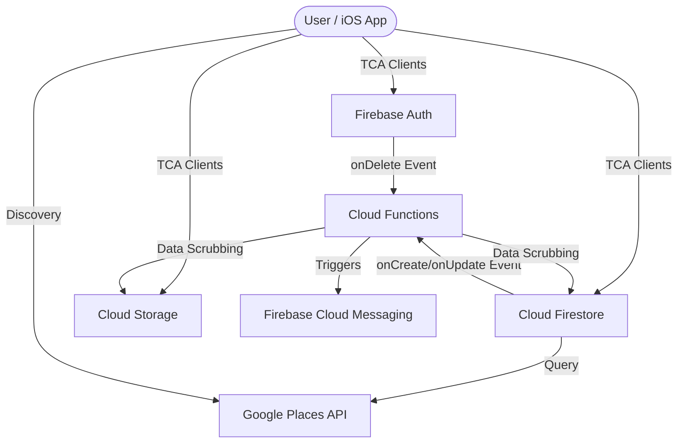

# ARCHITECTURE.md - System Architecture & Service Specification

This document provides a technical deep-dive into the "Inspired" yoga platform's backend architecture for system architect review.

---

## 1. System Overview & Data Flow
The system utilizes a serverless, event-driven architecture powered by the Google Cloud Platform (GCP) and the Firebase suite.

---

## 2. Service Specifications

### 2.1 Firebase Authentication (Auth)
*   **Purpose:** Identity management for Teachers and Students.
*   **Capabilities:** OAuth 2.0 (Google, Apple), Email/Password.
*   **Status:** "Login with Apple" is **deferred** (requires paid Apple Developer membership).
*   **Testing:** Rely on local USB debugging and "Personal Team" provisioning for on-device verification.
*   **Caveats:** 
    *   **Custom Claims:** Limited to 1KB. Used sparingly for `isTeacher` flags.
    *   **Rate Limits:** High, but Google/Apple login flows have external provider quotas.
*   **Documentation:** [Firebase Auth Documentation](https://firebase.google.com/docs/auth)

### 2.2 Cloud Firestore (NoSQL)
*   **Purpose:** Core database for profiles, groups, and real-time chat.
*   **Architecture:** Document-Collection model.
*   **Relationship Resolution (Client-side Join):** To maintain performance and minimize document size, many-to-many relationships (e.g., "Has user liked this post?") are resolved via **Client-side Joins**.
*   **Security & Privacy:** Access control is governed by the **Community-based Privacy** model. See [Section 3](#3-security--privacy-architecture) for details.
*   **Optimization Strategy (Future):** At extreme scale (millions of users), the `get()` call in security rules may impact costs. Future optimizations include:
        - **Local Session Cache:** Mirroring the user's `joinedCommunities` in local app state to predict visibility.
        - **Cloud Function Aggregation:** Pre-filtering feeds via server-side logic to reduce individual document security checks.
*   **Inter-service Comm:** Triggers Cloud Functions for server-side moderation or notifications.
*   **Limitations:**
    *   **Document Size:** Max 1 MiB per document.
    *   **Write Frequency:** ~1 write/sec per document (can be scaled via sharding if needed for massive groups).
    *   **Complexity:** No built-in `JOIN` support; relationships are managed via sub-collections or redundant denormalized data.
*   **Documentation:** [Cloud Firestore Quotas](https://firebase.google.com/docs/firestore/quotas)

### 2.3 Cloud Storage for Firebase
*   **Purpose:** Blob storage for profile pictures and media.
*   **Capabilities:** Public/Private access controlled by Storage Rules.
*   **Content Delivery (CDN):**
    *   **Mandate:** Serve all public assets (avatars, studio media) via the **Firebase Hosting CDN**.
    *   **Mechanism:** Map the Storage bucket to a Firebase Hosting path (e.g., `https://inspired-yoga.web.app/avatars/...`).
    *   **Cache Consistency:** Use **URL Fingerprinting** (e.g., `avatar.jpg?v=[timestamp]`) to instantly bypass CDN and browser/app caches when an image is updated. This ensures global consistency across all edge locations.
    *   **Storage Cleanup:** When an image is replaced, the **Firebase Storage SDK** (Client-side) or a **Cloud Function** (Server-side) must explicitly delete the previous thumbnail and standard resolution blobs to minimize storage costs.
*   **Multi-Resolution Strategy:**
    *   **Thumbnail:** 150x150 pixels (optimized for lists/avatars).
    *   **Standard:** 1024x1024 pixels (optimized for profile pages).
*   **Inter-service Comm:** Serves content to iOS app.
*   **Caveats:**
    *   **Bandwidth:** Egress costs are minimized by using thumbnails for list views.
    *   **Processing:** Local iOS-native downsampling (0.7 JPEG compression) is mandatory before upload.
*   **Documentation:** [Cloud Storage Documentation](https://firebase.google.com/docs/storage)

### 2.4 iOS Content Caching Strategy
*   **Mechanism:** Use **Native `URLCache`** and `URLSession` configuration.
*   **Server Alignment:** Configure `StorageMetadata` (e.g., `Cache-Control: public, max-age=3600`) via the Firebase SDK during upload.
*   **Performance:** This ensures that images are stored in the local on-disk cache of the iPhone, reducing repeat network requests for the same session.

### 2.5 Cloud Functions (Node.js / Python)
*   **Purpose:** Server-side logic, moderation workflows, and PII scrubbing.
*   **Limitations:**
    *   **Cold Starts:** Initial latency for infrequently used functions (minimized by keeping functions "warm" or using small footprints).
    - **Execution Time:** Max 9 minutes per execution.
*   **Documentation:** [Cloud Functions Documentation](https://firebase.google.com/docs/functions)

---

## 3. Usage & Throughput Estimates (Abstract Level)

Based on a starting community of 10,000 active users:

| Metric | Estimated Value | Rationale |
| :--- | :--- | :--- |
| **Reads (Firestore)** | 500k - 1M / Day | Heavy browse/feed discovery usage. |
| **Writes (Firestore)** | 100k - 200k / Day | Profile updates, group messages, and posts. |
| **Throughput (FCM)** | ~50k / Day | Real-time notifications for chat/groups. |
| **Data Growth** | ~1-5 GB / Month | Primarily user-generated content (images) after downsampling. |
| **Places API** | ~5,000 requests / Month | Discovery-based studio searches. |

---

## 3. Security & Privacy Architecture

This section serves as the canonical source for all backend access control and data privacy logic.

### 3.1 Least Privilege Principle
All Firebase services must adhere to the principle of Least Privilege. No collection-wide reads are permitted; queries must be scoped by specific IDs or approved filters.

### 3.2 Community-based Visibility (Privacy Model)
Access to sensitive user fields (e.g., `profilePictureUrl`) is controlled by **Visibility Levels** (`public` vs. `members-only`).
*   **Definition:** Two users are "connected" if they share at least one ID in their `joinedCommunities` array.
*   **Enforcement:** Handled via `firestore.rules` using `get()` and `hasAny()`.
*   **Joined Communities List:** By default, a user's list of joined groups is **`members-only`** visibility.
*   **Group Chat:** Message history is restricted to **active members** of the community. Non-members (even authenticated ones) are blocked from reading or writing to chat sub-collections.
*   **Issue Reports:** All support data is **`admin-only`**. No user can read data submitted by another user.
*   **Optimization:** Review performance once scale exceeds 100k active users (see optimization strategy in Section 2.2).

### 3.3 Automated Validation
Security rules are verified using an automated Node.js test suite (`infrastructure/scripts/test-rules.js`). This suite must be executed before any deployment to verify:
1.  Public access to non-sensitive data (Studios, Posts).
2.  Owner-only access to PII (Profiles).
3.  Community-based restriction logic.

---

## 4. Security Risk Assessment & Testing Guidelines

This section defines the strategy for identifying, testing, and mitigating security vulnerabilities and attack vectors.

### 4.1 Risk Dimensions & Attack Vectors
| Risk Category | Attack Vector | Mitigation Strategy |
| :--- | :--- | :--- |
| **Data Leakage** | Insecure Firestore/Storage rules allowing unauthorized `list` or `get` operations. | Strict **Least Privilege** rules; automated negative testing in `test-rules.js`. |
| **Privacy Violation** | PII (emails, names) being exposed in public profiles or leaked through logs. | Explicit PII marking in code; mandatory obfuscation in `os.log`; server-side PII scrubbing. |
| **Data Corruption** | Malicious or accidental malformed writes bypassing client-side validation. | **Schema Validation** inside Firestore Rules (checking types, ranges, and mandatory fields). |
| **Unauthorized Access** | Compromised auth tokens or "Insecure Direct Object Reference" (IDOR) on private documents. | Identity-based rules (`request.auth.uid == userId`); short-lived tokens. |
| **Denial of Service (DoS)** | Expensive queries (e.g., deep pagination, broad filters) designed to exhaust Firestore quotas/budget. | Query limiting; disabling broad `list` operations; budget alerts and automated throttling. **Critical Requirement:** A single valid but malicious authenticated user must not be able to exhaust the project's $50/month budget through repetitive expensive operations. |

### 4.2 Common Pitfalls & Comprehensive Review Checklist
A comprehensive security review must address these common architectural weaknesses:

#### 1. Data Loss & Corruption
*   **Pitfall:** Overwriting documents without checking for version consistency or state-specific logic.
*   **Review Requirement:** Use **Firestore Transactions** or **Batched Writes** for atomic operations. 
*   **Review Requirement:** All incoming data types and constraints (e.g., string length, numeric range) must be validated within Security Rules, never relying solely on the client.
*   **Review Requirement:** Ensure Cloud Functions are **idempotent** to prevent data corruption during execution retries.

#### 2. Data Leaks & Privacy Violations
*   **Pitfall:** Storing PII (e.g., full GPS coordinates) when only area-level data is needed.
*   **Review Requirement:** Verify **Location Fuzzing** implementation. Audit all Firestore documents to ensure no unhashed PII is stored unnecessarily.
*   **Review Requirement:** Check for "Rule Shadowing" where a broad rule inadvertently grants access to a sub-collection intended to be private.
*   **Review Requirement:** Ensure `profilePictureUrl` access (including both thumbnail and standard-resolution versions) is strictly gated by the Community-based Visibility model.

#### 3. Improper Input Validation & Budget Exhaustion
*   **Pitfall:** Trusting client-side logic for business-critical values (e.g., `isAdmin`, `price`, `status`).
*   **Pitfall:** Allowing unrestricted creation of high-cost documents or execution of complex queries by a single UID.
*   **Review Requirement:** All state transitions (e.g., `pending` to `approved`) must be enforced by Cloud Functions or locked down via Security Rules using `request.resource.data.diff()`.
*   **Review Requirement:** Analyze the "Cost-per-Query" for all primary user flows. Implement server-side or rule-based rate limiting for any operation that could be abused to trigger significant billable events.

### 4.3 Security Testing Workflow
1.  **Static Analysis:** Periodically review `firestore.rules` and `storage.rules` for overly permissive wildcards (e.g., `allow read: if true`).
2.  **Negative TDD:** For every new feature, write a test case in `test-rules.js` that explicitly attempts to read/write data as an unauthorized user and confirms the request is rejected.
3.  **Fuzz Testing:** Attempt to write documents with missing fields, incorrect data types (e.g., string instead of int), or exceptionally long strings to test the robustness of validation rules.
4.  **Privacy Audit:** Use the Firebase Emulator UI to inspect created documents and ensure no PII is visible in fields intended for public discovery.

---

## 5. Cost Estimation & Budget Alignment ($50/Month Cap)

Based on the 10,000-user usage model on the **Firebase Blaze (Pay-as-you-go)** plan, but benefiting from the **Free Spark Tier** quotas:

| Service | Estimated Usage | Projected Monthly Cost | Rationale |
| :--- | :--- | :--- | :--- |
| **Cloud Firestore** | 30M Reads / 6M Writes | **$10 - $15** | Spark Tier covers 1.5M reads/600k writes/month. Excess is priced at $0.06 - $0.18 per 100k. |
| **Cloud Storage / CDN** | 50 GB Stored / 10 GB Egress | **$2 - $5** | Spark Tier covers 5GB Storage/10GB Hosting Transfer. CDN caching via Firebase Hosting significantly reduces repeated egress costs. |
| **Cloud Functions** | 200k Executions | **$0 - $2** | Spark Tier covers 125k. Excess cost is negligible for small functions. |
| **Firebase Auth** | 10k Active Users | **$0** | No cost for standard OAuth/Email providers. |
| **FCM** | 1.5M Notifications | **$0** | Free and unlimited. |
| **Google Places API** | 5,000 Autocomplete/Detail | **$10 - $20** | This is the highest variable cost. Usage must be strictly controlled (e.g., caching/fuzzing). |
| **TOTAL ESTIMATE** | **-** | **$22 - $42** | **Fits within $50/month cap.** |

**Budget Mitigation Strategy:**
*   **Alerting:** Set budget alerts at $25 (50%) and $40 (80%) in GCP Console.
*   **Throttling:** If costs approach $50, the `scripts/fetch-config.sh` or Cloud Functions can be set to "Read-Only" mode to prevent further billable writes.

---

## 6. Architect's Review & Validation

**Critical Validation Points:**
1.  **Denormalization Strategy:** Ensure Firestore schemas balance read performance with the risk of stale data.
2.  **Concurrency:** Monitor the 1 write/sec Firestore limit for high-frequency group chats. Consider "Chat Sub-collections" or Real-time Database for high-scale rooms.
3.  **Privacy:** Verify Firestore Security Rules against the "Least Privilege" mandate in `GEMINI.md`.

---

*Note: This documentation is maintained alongside the [FEATURES.md](./FEATURES.md) and [GEMINI.md](./GEMINI.md) files.*
