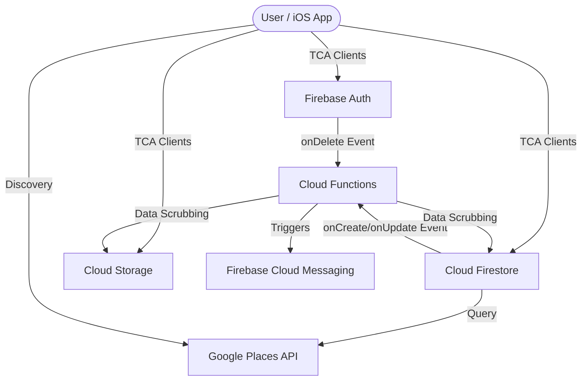

# ARCHITECTURE.md - System Architecture & Service Specification

This document provides a technical deep-dive into the "Inspired" yoga platform's backend architecture for system architect review.

---

## 1. System Overview & Data Flow
The system utilizes a serverless, event-driven architecture powered by the **Google Cloud Platform (GCP)** and the **Firebase** suite.

### 1.1 Core Architectural Decisions
*   **Regional Mandate:** All backend services (Firestore, Cloud Storage, Cloud Functions) are deployed to the **`europe-west1` (Belgium)** region to ensure data residency within the EU and minimize inter-service latency.
*   **Infrastructure as Code (IaC):** All infrastructure is defined and deployed via **Terraform (.tf) files directly**. Direct HCL (HashiCorp Configuration Language) is chosen to maintain industry standard compatibility and ensure full access to GCP provider features without unnecessary abstraction layers.
*   **Database Selection:** **Cloud Firestore (NoSQL)** is chosen for its superior cost efficiency (generous free tier), built-in real-time listeners for chat/posts, and schema flexibility during rapid development.
*   **Local Development:** local development is targeted at the **Firebase Emulator** using the `Debug (Local)` configuration.


```mermaid
graph TD
    User([User / iOS App]) -->|TCA Clients| Auth[Firebase Auth]
    User -->|TCA Clients| Firestore[Cloud Firestore]
    User -->|TCA Clients| Storage[Cloud Storage]
    
    Auth -->|onDelete Event| Functions[Cloud Functions]
    Firestore -->|onCreate/onUpdate Event| Functions
    
    Functions -->|Triggers| FCM[Firebase Cloud Messaging]
    Functions -->|Data Scrubbing| Firestore
    Functions -->|Data Scrubbing| Storage
    
    Firestore -->|Query| Places[Google Places API]
    User -->|Discovery| Places
```

---

## 2. Service Specifications

### 2.1 Firebase Authentication (Auth)
*   **Purpose:** Identity management for Teachers and Students.
*   **Capabilities:** OAuth 2.0 (Google, Apple), Email/Password.
*   **Status:** "Login with Apple" is **deferred** (requires paid Apple Developer membership).
*   **Testing:** Rely on local USB debugging and "Personal Team" provisioning for on-device verification.
*   **Caveats:** 
    *   **Custom Claims:** Limited to 1KB. Used sparingly for `isTeacher` flags.
    *   **Rate Limits:** High, but Google/Apple login flows have external provider quotas.
*   **Documentation:** [Firebase Auth Documentation](https://firebase.google.com/docs/auth)

### 2.2 Cloud Firestore (NoSQL)
*   **Purpose:** Core database for profiles, groups, and real-time chat.
*   **Architecture:** Document-Collection model.
*   **Relationship Resolution (Client-side Join):** To maintain performance and minimize document size, many-to-many relationships (e.g., "Has user liked this post?") are resolved via **Client-side Joins**.
*   **Security & Privacy:** Access control is governed by the **Community-based Privacy** model. See [Section 3](#3-security--privacy-architecture) for details.
*   **Optimization Strategy (Future):** At extreme scale (millions of users), the `get()` call in security rules may impact costs. Future optimizations include:
        - **Local Session Cache:** Mirroring the user's `joinedCommunities` in local app state to predict visibility.
        - **Cloud Function Aggregation:** Pre-filtering feeds via server-side logic to reduce individual document security checks.
*   **Inter-service Comm:** Triggers Cloud Functions for server-side moderation or notifications.
*   **Content Moderation Strategy:** 
    - **Workflow:** Use Firestore Security Rules and Cloud Functions to enforce studio-owner approval before community content becomes public.
    - **Automated Moderation:** Utilize **Firebase Extensions** (e.g., "Moderate Content with Perspective API") for initial automated filtering of comments and posts.
    - **Markdown Constraints:** Store content as Markdown with a maximum limit of **500 characters** per entry to ensure performance and readability across all clients.
*   **Pagination & Limits:**
    - **Query Limit:** All feed and discovery queries are limited to a maximum of **25 documents per request** to ensure low latency and minimize Firestore read costs.
    - **Tiered Fetching:** To minimize unnecessary reads while ensuring a "live" feel, the client follows a tiered discovery strategy:
        1.  **30-Day Window:** Initial query for recent activity.
        2.  **6-Month Window:** Fallback query if the 30-day window is empty.
        3.  **Cross-Area Discovery:** If local results are sparse, the query expands to neighbouring postcode prefixes.
    - **Implementation:** Utilize Firestore **Query Cursors** (`startAfter`) for seamless, infinite-scrolling pagination.

### 2.3 Feed Generation Strategy (Scale-Adaptive)
The platform uses a two-stage strategy to balance cost and performance as the user base grows.

#### Stage 1: Client-Side Merge-Sort (Current: <100k Users)
To maintain low write costs and avoid complex composite indexes, the feed is aggregated on the client:
1.  **Parallel Execution:** The iOS app fires multiple parallel queries:
    - **Area Query:** Fetch top 25 posts for the `currentArea`.
    - **Community Query (Chunked):** Fetch top 25 posts using the `whereField("source.id", in: [...])` filter. Since Firestore limits `IN` queries to 30 items, the user's `joinedCommunities` list is split into chunks of 30, each triggering a parallel query.
2.  **Merging Logic:** The `FeedReducer` awaits all results, merges the arrays, sorts them by `createdAt` (descending), and takes the top 25 for rendering.
3.  **Pagination:** Subsequent pages use the timestamp of the last visible post as a `startAfter` cursor for all sub-queries.

#### Stage 2: Feed Fan-out (Target: >100k Users)
Once write volume is justified by high read demand, the system will pivot to a "Write-on-Post" model:
*   **Mechanism:** A Cloud Function triggers on `posts.onCreate`. It fetches the member list of the source community/area and writes the post ID into `individual_feeds/{userId}/posts/{postId}` for every member.
*   **Performance:** Feed fetching becomes a single O(1) query to a single collection, drastically reducing latency for heavy users.

### 2.4 IP-to-Area Mapping (Location Privacy)
*   **Mechanism:** To avoid external API costs and maintain privacy, we utilize **Request Headers** from the hosting provider (e.g., `x-appengine-citylatlong` or Cloudflare headers) within a Cloud Function.
*   **Centroid Proximity:** neighbouring areas are determined by calculating the distance between **Postcode Centroids**.
*   **Data Source:** Postcode centroid data is derived from the **ONS Postcode Directory**, used under the **Open Government Licence (OGL)**.
*   **Privacy:** Exact GPS is never requested; the IP is resolved to a postcode prefix (e.g., "W12") before being compared against indexed centroids.
*   **Limitations:**
    *   **Document Size:** Max 1 MiB per document.
    *   **Write Frequency:** ~1 write/sec per document (can be scaled via sharding if needed for massive groups).
    *   **Complexity:** No built-in `JOIN` support; relationships are managed via sub-collections or redundant denormalized data.
*   **Documentation:** [Cloud Firestore Quotas](https://firebase.google.com/docs/firestore/quotas)

### 2.3 Cloud Storage for Firebase
*   **Purpose:** Blob storage for profile pictures and media.
*   **Capabilities:** Public/Private access controlled by Storage Rules.
*   **Content Delivery (CDN):**
    *   **Mandate:** Serve all public assets (avatars, studio media) via the **Firebase Hosting CDN**.
    *   **Mechanism:** Map the Storage bucket to a Firebase Hosting path (e.g., `https://inspired-yoga.web.app/avatars/...`).
    *   **Cache Consistency:** Use **URL Fingerprinting** (e.g., `avatar.jpg?v=[timestamp]`) to instantly bypass CDN and browser/app caches when an image is updated. This ensures global consistency across all edge locations.
    *   **Storage Cleanup:** When an image is replaced, the **Firebase Storage SDK** (Client-side) or a **Cloud Function** (Server-side) must explicitly delete the previous thumbnail and standard resolution blobs to minimize storage costs.
*   **Multi-Resolution Strategy:**
    *   **Thumbnail:** 150x150 pixels (optimized for lists/avatars).
    *   **Standard:** 1024x1024 pixels (optimized for profile pages).
*   **Inter-service Comm:** Serves content to iOS app.
*   **Caveats:**
    *   **Bandwidth:** Egress costs are minimized by using thumbnails for list views.
    *   **Processing:** Local iOS-native downsampling (0.7 JPEG compression) is mandatory before upload.
*   **Documentation:** [Cloud Storage Documentation](https://firebase.google.com/docs/storage)

### 2.4 iOS Content Caching Strategy
*   **Mechanism:** Use **Native `URLCache`** and `URLSession` configuration.
*   **Server Alignment:** Configure `StorageMetadata` (e.g., `Cache-Control: public, max-age=3600`) via the Firebase SDK during upload.
*   **Performance:** This ensures that images are stored in the local on-disk cache of the iPhone, reducing repeat network requests for the same session.

### 2.5 Cloud Functions (Node.js / Python)
*   **Purpose:** Server-side logic, moderation workflows, and PII scrubbing.
*   **Limitations:**
    *   **Cold Starts:** Initial latency for infrequently used functions (minimized by keeping functions "warm" or using small footprints).
    - **Execution Time:** Max 9 minutes per execution.
*   **Documentation:** [Cloud Functions Documentation](https://firebase.google.com/docs/functions)

### 2.6 Data Serialization Standards
*   **Dates & Timestamps:** All date fields must be serialized as **ISO 8601** strings (e.g., `2026-02-18T10:00:00Z`) in JSON seed files and API responses to ensure platform-independent parsing. Firestore Timestamps are used internally but converted for client transport.
*   **Enums:** Enum values in data (e.g., `privacySettings`) must strictly match the string raw values defined in the iOS `Codable` structs.

---

## 3. Cloud Functions Index

This index serves as the canonical list of all serverless backend logic. All functions must be authenticated and utilize App Check where applicable.

| Function Name | Trigger Type | Primary Responsibility | Security / Mandate |
| :--- | :--- | :--- | :--- |
| **`validateDisplayName`** | HTTPS Callable | Profanity and constraint filtering for new display names. | Auth Required + App Check. |
| **`generateUsernameSuffix`** | Firestore (onCreate) | Appends a random 4-digit suffix to create a unique `username#1234`. | System Trigger. |
| **`onUserDelete`** | Auth (onDelete) | Purges all PII from Firestore and Storage upon account deletion. | **Right to be Forgotten Mandate.** |
| **`moderateContent`** | Firestore (onCreate) | Automated toxic language filtering via Perspective API extension. | Content Safety. |
| **`approveStudioContent`**| Firestore (onCreate) | Gates studio-specific content until owner approval is granted. | Studio Integrity. |
| **`discoverStudios`** | Scheduled | Discovers and seeds new yoga studios as "Shadow Profiles". | Automated Discovery. |
| **`dailyFirestoreExport`**| Scheduled | Daily database dump to GCS Coldline for disaster recovery. | **DR Mandate.** |
| **`dailyAuthExport`** | Scheduled | Daily export of UID <-> Email mapping for identity recovery. | **DR Mandate.** |
| **`storageHygiene`** | Firestore (onUpdate)| Deletes old image blobs when a user updates their profile picture. | Cost Control. |
| **`sendNotifications`** | Firestore (onCreate)| Triggers FCM alerts for new chat messages or group posts. | Real-time Engagement. |
| **`search`** | HTTPS Callable | Multi-entity search (Areas, Communities, Studios). | Auth Required + App Check. |

---

## 4. Search & Discovery Strategy
The search experience is powered by a centralized Cloud Function to ensure consistent logic across platforms and to protect database structure.

### 4.1 Tiered Entity Matching
The `search` function implements a priority-based matching algorithm:
1.  **Postcode Prefix:** Direct match against `location_prefix`.
2.  **Area Translation:** Maps descriptive names (e.g., "Hammersmith") to their canonical postcode prefixes (W6).
3.  **Name Search:** Case-insensitive partial matching on the `name` field of all entities.
4.  **Keyword Search:** Scans `description` and `about` fields for relevant tags.

### 4.2 Proximity-Based Suggestions (Discovery)
When no query is provided, the function returns "Discovery" results:
-   **Context:** Uses the user's `currentAreaPrefix` passed in the request.
-   **Result Set:** Communities and Studios within the same prefix, followed by neighboring prefixes (determined by centroid distance).

---

## 4. Usage & Throughput Estimates (Abstract Level)

Based on a starting community of 10,000 active users:

| Metric | Estimated Value | Rationale |
| :--- | :--- | :--- |
| **Reads (Firestore)** | 500k - 1M / Day | Heavy browse/feed discovery usage. |
| **Writes (Firestore)** | 100k - 200k / Day | Profile updates, group messages, and posts. |
| **Throughput (FCM)** | ~50k / Day | Real-time notifications for chat/groups. |
| **Data Growth** | ~1-5 GB / Month | Primarily user-generated content (images) after downsampling. |
| **Places API** | ~5,000 requests / Month | Discovery-based studio searches. |

---

## 3. Security & Privacy Architecture

This section serves as the canonical source for all backend access control and data privacy logic.

### 3.1 Least Privilege Principle
All Firebase services must adhere to the principle of Least Privilege. No collection-wide reads are permitted; queries must be scoped by specific IDs or approved filters.

### 3.2 Community-based Visibility (Privacy Model)
Access to sensitive user fields (e.g., `profilePictureUrl`) is controlled by **Visibility Levels** (`public` vs. `members-only`).
*   **Definition:** Two users are "connected" if they share at least one ID in their `joinedCommunities` array.
*   **Enforcement:** Handled via `firestore.rules` using `get()` and `hasAny()`.
*   **Joined Communities List:** By default, a user's list of joined groups is **`members-only`** visibility.
*   **Group Chat:** Message history is restricted to **active members** of the community. Non-members (even authenticated ones) are blocked from reading or writing to chat sub-collections.
*   **Issue Reports:** All support data is **`admin-only`**. No user can read data submitted by another user.
*   **Optimization:** Review performance once scale exceeds 100k active users (see optimization strategy in Section 2.2).

### 3.4 Stale Metadata & The "Security-First" Tradeoff
The system utilizes **denormalized author metadata** (username, thumbnailUrl, avatarPrivacy) within Post documents to ensure high-performance feed rendering without complex joins.

*   **Tradeoff:** If a user changes their `avatarPrivacy` or `isProfilePublic` status, existing posts will retain the **old** privacy settings in their metadata until those posts are explicitly updated or re-indexed.
*   **Intentional Behavior (Private -> Public):** If a user transitions from private to public, their older posts will continue to display as "groups-only" or "private" in the feed. This is an intentional tradeoff to maintain the privacy context of the original share and avoid expensive mass-updates of historical data.
*   **Enforced Security (Public -> Private):** If a user transitions from public to private, their older posts might still contain a `thumbnailUrl` and a `public` flag. However, the **Cloud Storage Rules** (for the image binary) and **Firestore Rules** (for the profile fetch) always perform a **live check** against the current User document. 
*   **Result:** The user's privacy is always protected at the protocol level. A stale "public" flag in a Post may result in a `403 Forbidden` error when fetching the image or a `Permission Denied` when tapping the profile, which the client must handle gracefully.

### 3.5 Infrastructure & Automation Learnings
*   **Fastlane Xcodebuild Stability:** Fastlane's `scan` may time out (default 3s) during the `showBuildSettings` phase on large projects with many SPM dependencies. Set `ENV["FASTLANE_XCODEBUILD_SETTINGS_TIMEOUT"] = "120"` in the `Fastfile` to prevent intermittent test failures.
*   **Deep-Link & Magic Link Testing:** Passwordless Magic Link flows cannot be fully automated via XCUITest due to out-of-band email delivery and deep-link interception requirements. These flows must be verified **manually** on physical devices or via Deep Link CLI simulators.
*   **Stale Metadata Security:** NoSQL denormalization requires acceptence of stale metadata (e.g., old post authors). Absolute security must be enforced via **Live Firestore/Storage Rules** that check the current state of the User document before serving sensitive assets.

---

## 4. Security Risk Assessment & Testing Guidelines

This section defines the strategy for identifying, testing, and mitigating security vulnerabilities and attack vectors.

### 4.1 Risk Dimensions & Attack Vectors
| Risk Category | Attack Vector | Mitigation Strategy |
| :--- | :--- | :--- |
| **Data Leakage** | Insecure Firestore/Storage rules allowing unauthorized `list` or `get` operations. | Strict **Least Privilege** rules; automated negative testing in `test-rules.js`. |
| **Privacy Violation** | PII (emails, names) being exposed in public profiles or leaked through logs. | Explicit PII marking in code; mandatory obfuscation in `os.log`; server-side PII scrubbing. |
| **Data Corruption** | Malicious or accidental malformed writes bypassing client-side validation. | **Schema Validation** inside Firestore Rules (checking types, ranges, and mandatory fields). |
| **Unauthorized Access** | Compromised auth tokens or "Insecure Direct Object Reference" (IDOR) on private documents. | Identity-based rules (`request.auth.uid == userId`); short-lived tokens. |
| **Denial of Service (DoS)** | Expensive queries (e.g., deep pagination, broad filters) designed to exhaust Firestore quotas/budget. | Query limiting; disabling broad `list` operations; budget alerts and automated throttling. **Critical Requirement:** A single valid but malicious authenticated user must not be able to exhaust the project's $50/month budget through repetitive expensive operations. |

### 4.2 Common Pitfalls & Comprehensive Review Checklist
A comprehensive security review must address these common architectural weaknesses:

#### 1. Data Loss & Corruption
*   **Pitfall:** Overwriting documents without checking for version consistency or state-specific logic.
*   **Review Requirement:** Use **Firestore Transactions** or **Batched Writes** for atomic operations. 
*   **Review Requirement:** All incoming data types and constraints (e.g., string length, numeric range) must be validated within Security Rules, never relying solely on the client.
*   **Review Requirement:** Ensure Cloud Functions are **idempotent** to prevent data corruption during execution retries.

#### 2. Data Leaks & Privacy Violations
*   **Pitfall:** Storing PII (e.g., full GPS coordinates) when only area-level data is needed.
*   **Review Requirement:** Verify **Location Fuzzing** implementation. Audit all Firestore documents to ensure no unhashed PII is stored unnecessarily.
*   **Review Requirement:** Check for "Rule Shadowing" where a broad rule inadvertently grants access to a sub-collection intended to be private.
*   **Review Requirement:** Ensure `profilePictureUrl` access (including both thumbnail and standard-resolution versions) is strictly gated by the Community-based Visibility model.

#### 3. Improper Input Validation & Budget Exhaustion
*   **Pitfall:** Trusting client-side logic for business-critical values (e.g., `isAdmin`, `price`, `status`).
*   **Pitfall:** Allowing unrestricted creation of high-cost documents or execution of complex queries by a single UID.
*   **Review Requirement:** All state transitions (e.g., `pending` to `approved`) must be enforced by Cloud Functions or locked down via Security Rules using `request.resource.data.diff()`.
*   **Review Requirement:** Analyze the "Cost-per-Query" for all primary user flows. Implement server-side or rule-based rate limiting for any operation that could be abused to trigger significant billable events.

### 4.3 Security Testing Workflow
1.  **Static Analysis:** Periodically review `firestore.rules` and `storage.rules` for overly permissive wildcards (e.g., `allow read: if true`).
2.  **Negative TDD:** For every new feature, write a test case in `test-rules.js` that explicitly attempts to read/write data as an unauthorized user and confirms the request is rejected.
3.  **Fuzz Testing:** Attempt to write documents with missing fields, incorrect data types (e.g., string instead of int), or exceptionally long strings to test the robustness of validation rules.
4.  **Privacy Audit:** Use the Firebase Emulator UI to inspect created documents and ensure no PII is visible in fields intended for public discovery.

#### 4.4 Local Authentication & Secret Management
*   **Local-Only Auth:** Email/Password authentication is strictly reserved for the **Local Emulator environment**. Staging and Production environments must exclusively use OAuth providers (Google/Apple) to eliminate the risk of password database breaches.
*   **Non-Persistent Credentials:** No passwords, even for test accounts, are stored in the repository or seed JSON files. 
*   **Injection Pipeline:** Local secrets are managed via a `.env` file (git-ignored) and injected into the automated test suite via the following chain: 
    `Local .env` -> `Fastlane` -> `XCTest Environment` -> `App Launch Arguments`.
*   **Backdoor Enforcement:** The "forced authentication" path used in UI tests is only compiled in `DEBUG` builds and requires a matching UID and Password passed via launch arguments.

### 4.5 Unified User Privacy Matrix
Users are distinguished solely by their privacy settings. The following logic is enforced via Firestore Security Rules (for metadata) and Cloud Storage Rules (for binaries):

| Avatar Privacy | Profile Privacy | Who can view Profile (Bio, Name) | Who can view Avatar (Std & Thumb) |
| :--- | :--- | :--- | :--- |
| `groups-only` | `private` | **Only the Owner.** | Users with at least one **Joined Community overlap** (includes Personal Community subscriptions). |
| `public` | `private` | **Only the Owner.** | **Everyone.** |
| `public` | `public` | **Everyone** (Searchable). | **Everyone.** |
| `groups-only` | `public` | *Invalid State.* | Automatically forced to `public`. |

**Unified Connection Model:**
*   **Connection Definition:** Two users are "connected" if they share at least one ID in their `joinedCommunities` array.
*   **Personal Community ID:** `user_sub_{userId}`.
*   **Subscription Enforcement:** A user can only append `user_sub_{targetId}` to their `joinedCommunities` if the target profile has `isProfilePublic: true`. This is enforced via Firestore Security Rules.

**Access Logic (Enforcement):**
*   **Profile Metadata (Firestore):** `allow read: if isOwner() || resource.data.privacySettings.isProfilePublic == true`.
*   **Avatar Binary (Storage):** `allow read: if isOwner() || avatarIsPublic() || (avatarIsGroupsOnly() && hasCommunityOverlap())`.
*   **Denormalization:** When a user posts, the `thumbnailUrl` and `avatarPrivacy` are denormalized in the `Post`. The client uses `avatarPrivacy` to decide whether to show the image or a "Community-Only" placeholder (though the binary is secured at the storage level regardless).

### 4.6 Magic Link Anti-Spam & Rate Limiting
To prevent email provider throttling and Firebase billing exhaustion, the following multi-layer protection is enforced:

1.  **Firebase App Check (Primary Defense):**
    *   **Enforcement:** All Authentication requests (OAuth and Magic Link) must include a valid **App Check Token**.
    *   **Provider:** DeviceCheck or AppAttest (iOS).
    *   **Result:** Requests from unauthorized clients (scripts, bots, modified binaries) are rejected before triggering an email send or backend operation.
2.  **Server-Side Rate Limiting (Cloud Functions):**
    *   **Mechanism**: A Firestore-based request log (`/_internal_rate_limits/validateName_{uid}`) tracks the last call time.
    *   **Policy (validateDisplayName)**: Max 1 request per 2 seconds per UID.
    *   **Policy (sendSignInLink)**: If using a Cloud Function wrapper, max 5 requests per 15 minutes. Documents are automatically purged via TTL policies.
3.  **Authentication & App Check**:
    *   `validateDisplayName` is restricted to authenticated users only (`request.auth != null`).
    *   App Check is enforced to reject requests from unofficial app binaries.
3.  **Client-Side "Cooldown" State:**
    *   The UI enforces a 60-second lockout period to manage user expectations and reduce accidental double-taps.

### 4.7 Cloud Functions API Reference
All backend logic is exposed via **HTTPS Callable Functions**. These require an authenticated Firebase Auth session and a valid App Check token.

#### 1. `validateDisplayName`
*   **Purpose**: Validates a proposed display name for profanity, length, and character constraints.
*   **Authentication**: Required (`request.auth != null`).
*   **App Check**: Required.
*   **Request Data**:
    ```json
    { "displayName": "string" }
    ```
*   **Success Response** (`200 OK`):
    ```json
    { 
      "isValid": "boolean",
      "reason": "string?" // Present if isValid is false
    }
    ```
*   **Error Codes**:
    *   `unauthenticated`: User session is missing or expired.
    *   `resource-exhausted`: Rate limit hit (1 request per 2 seconds).
    *   `invalid-argument`: Missing or malformed `displayName`.

### 4.8 Seeding & Environment Strategies
To maintain security and testability, we employ different seeding strategies based on the environment:

| Feature | Local Emulator | Staging / Production |
| :--- | :--- | :--- |
| **Firestore Profiles** | **Seeded.** Atomic reset of all collections. | **Seeded.** Used to create "Shadow Profiles" for testers. |
| **Auth Identities** | **Seeded.** Accounts created with a local master password. | **Manual / OAuth.** Users created via real Google/Apple sign-in. |
| **Profile Linkage** | Automatic (via seeded UID). | Manual (seeded Profile ID must match real tester's UID). |
| **Credentials** | Email/Password enabled. | OAuth Providers ONLY. |

---

## 5. Cost Estimation & Budget Alignment ($50/Month Cap)

Based on the 10,000-user usage model on the **Firebase Blaze (Pay-as-you-go)** plan, but benefiting from the **Free Spark Tier** quotas:

| Service | Estimated Usage | Projected Monthly Cost | Rationale |
| :--- | :--- | :--- | :--- |
| **Cloud Firestore** | 30M Reads / 6M Writes | **$10 - $15** | Spark Tier covers 1.5M reads/600k writes/month. Excess is priced at $0.06 - $0.18 per 100k. |
| **Cloud Storage / CDN** | 50 GB Stored / 10 GB Egress | **$2 - $5** | Spark Tier covers 5GB Storage/10GB Hosting Transfer. CDN caching via Firebase Hosting significantly reduces repeated egress costs. |
| **Cloud Functions** | 200k Executions | **$0 - $2** | Spark Tier covers 125k. Excess cost is negligible for small functions. |
| **Firebase Auth** | 10k Active Users | **$0** | No cost for standard OAuth/Email providers. |
| **FCM** | 1.5M Notifications | **$0** | Free and unlimited. |
| **Google Places API** | 5,000 Autocomplete/Detail | **$10 - $20** | This is the highest variable cost. Usage must be strictly controlled (e.g., caching/fuzzing). |
| **Backup & Recovery** | Daily Snapshots | **$5 - $10** | **GCS Coldline:** ~$0.004/GB (approx $1/mo for 150GB). **Firestore:** Standard read rates for export operations (approx $5-$9/mo depending on DB size). |
| **TOTAL ESTIMATE** | **-** | **$30 - $50** | **Fits within $50/month cap.** |

**Budget Mitigation Strategy:**
*   **Alerting:** Set budget alerts at $25 (50%) and $40 (80%) in GCP Console.
*   **Throttling:** If costs approach $50, the `scripts/fetch-config.sh` or Cloud Functions can be set to "Read-Only" mode to prevent further billable writes.

---

## 6. Disaster Recovery & Backup Strategy

To ensure business continuity and protect against catastrophic failures (e.g., accidental deletion, region outage, or corruption), the platform implements a multi-layer backup strategy.

### 6.1 Infrastructure State (Terraform)
*   **Risk:** Loss or corruption of the Terraform State file, leading to an inability to manage infrastructure.
*   **Strategy:** **GCS Remote Backend** with **Object Versioning**.
*   **Implementation:**
    *   The Terraform state is stored in a dedicated, private GCS bucket (e.g., `tf-state-inspired-yoga`).
    *   **Versioning** is enabled on this bucket, allowing rollback to any previous state file version in case of corruption.
    *   **State Locking** is enabled to prevent concurrent modifications.

### 6.2 Database & Data (Firestore)
*   **Risk:** Accidental deletion of collections or malicious data corruption.
*   **Strategy:** **Daily Scheduled Exports**.
*   **Implementation:**
    *   **Mechanism:** A Cloud Scheduler job triggers a specialized Cloud Function (or `gcloud` operation) every 24 hours.
    *   **Destination:** Exports are written to a dedicated "Coldline" GCS bucket to minimize storage costs.
    *   **Retention:** A GCS Lifecycle Rule automatically deletes backups older than **30 days**.
*   **Recovery:** Data is restored via the `gcloud firestore import` command, which can restore specific collections or the entire database.

### 6.3 Authentication Data (User Identity)
*   **Risk:** Loss of the User ID <-> Email mapping, rendering the database orphaned.
*   **Strategy:** **Daily Auth Export**.
*   **Implementation:**
    *   A scheduled script (via Cloud Functions) utilizes the Firebase Admin SDK (`auth.listUsers()`) to dump all user records to a JSON file in the secure backup bucket.
    *   **Security:** This file contains sensitive PII and is strictly locked down via IAM roles.

### 6.4 Recovery Procedures
*   **Infrastructure Failure:** Run `terraform init` and `terraform apply` using the last known good state version from the GCS bucket.
*   **Data Corruption:**
    1.  **Stop Writes:** Switch the platform to "Maintenance Mode" (via Remote Config or Security Rules).
    2.  **Import:** Execute `gcloud firestore import gs://[BUCKET]/[TIMESTAMP]` to restore the affected collections.
    3.  **Verify:** Validate data integrity on a staging instance before re-enabling production traffic.

---

## 7. Architect's Review & Validation

**Critical Validation Points:**
1.  **Denormalization Strategy:** Ensure Firestore schemas balance read performance with the risk of stale data.
2.  **Concurrency:** Monitor the 1 write/sec Firestore limit for high-frequency group chats. Consider "Chat Sub-collections" or Real-time Database for high-scale rooms.
3.  **Privacy:** Verify Firestore Security Rules against the "Least Privilege" mandate in `GEMINI.md`.

---

## 8. Security Vulnerability Log

| ID | Date | Issue | Remediation | Learning |
| :--- | :--- | :--- | :--- | :--- |
| **SEC-001** | 2026-02-28 | **Invalid Seed Data:** `users.json` contained `showJoinedGroups: "all"`, which was not a valid enum value, causing silent decoding failures during profile fetch. | Updated `users.json` to use `"public"`. Added `updatedAt` field. | **Seed Integrity:** Mock/Seed data must strictly adhere to the production schema. Invalid data can mask auth failures by triggering fallback paths (e.g., returning to Login) instead of crashing explicitly. |
| **SEC-002** | 2026-02-28 | **Hardcoded Test Credentials:** `seeder.js` and `AppFeature.swift` used a hardcoded password (`password123`) for all emulator accounts. | Implemented secure injection pipeline: `.env` -> Fastlane -> XCTest -> LaunchArgs. | **Credential Hygiene:** Even test passwords must never be committed. Using a local-only injection pipeline ensures Staging/Prod remains isolated and secure. |

---

*Note: This documentation is maintained alongside the [FEATURES.md](./FEATURES.md) and [GEMINI.md](./GEMINI.md) files.*
