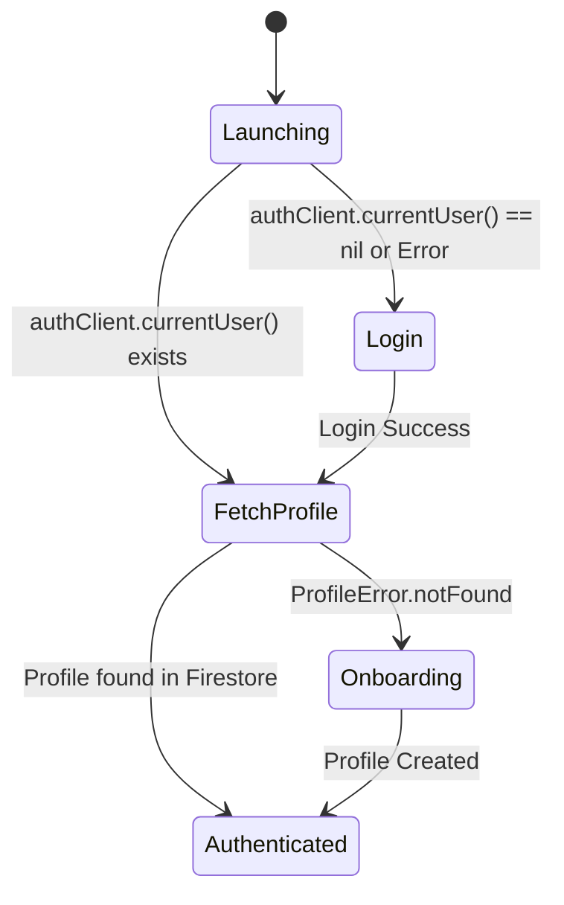
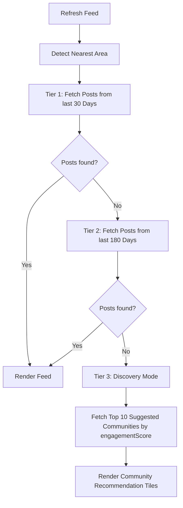

# PWA & iOS Feature Parity Matrix & Business Logic Specification

**Date:** 2026-08-28  
**Source Code Reference:** `Apps/iOS/InspiredYogaPlatform/Inspired/`  
**Target Application:** `Apps/PWA/` (React + Vite + TypeScript + Tailwind CSS)

---

## 1. Overview & Purpose
This document bridges the gap between the native iOS SwiftUI/TCA implementation and the PWA web application. It codifies all business logic, state machines, validation constraints, fallback algorithms, and data structures implemented in Swift so that the PWA achieves 1:1 feature and behavioral parity without relying on undocumented iOS code assumptions.

---

## 2. State Machines & Navigation Logic

### 2.1 App Launch & Session Restoration (`AppFeature.swift`)


**State Transitions:**
1. **Initial State:** `launching` (Displays `LaunchView` logo & spinner).
2. **Auth Verification:** Reads `authClient.currentUser()`.
   - If `nil` or Auth failure -> Transition to `login`.
   - If user ID exists -> Call `firestoreClient.fetchUserProfile(userId)`.
3. **Profile Lookup:**
   - On Success -> Transition to `authenticated(LandingPageState)` and dispatch feed refresh.
   - On `ProfileError.notFound` -> Retrieve `auth.displayName`, transition to `onboarding(userId, displayName)`.
   - On Other Error -> Transition to `login`.

---

## 3. Core Feature Specifications & Validation Rules

### 3.1 Login & Authentication (`LoginFeature.swift`)
- **Email Validation:** Must contain `@` and `.`.
- **Magic Link Cooldown:** 60-second countdown timer activated upon sending magic link. Retry button disabled while `cooldownRemaining > 0`.
- **Google Sign-In:** Pop-up OAuth flow restoring auth token into Firebase Auth.

### 3.2 Onboarding & Profile Setup (`OnboardingFeature.swift`)
- **Display Name Constraint:** Minimum 2 characters (`displayName.length >= 2`).
- **Generated Username Handle:** Standard format: `"{name_lowercased_with_underscores}#1234"`. Defaults to `"username#1234"` if empty.
- **Name Moderation Cloud Function:** Calls callable Cloud Function `validateDisplayName({ displayName })`. Returns `{ isValid: boolean, reason?: string }`.
- **Default Privacy Settings:**
  - `isProfilePublic`: `false`
  - `avatarPrivacy`: `"groups-only"`
  - `showJoinedGroups`: `"members-only"`
- **Default User State:** `joinedCommunities`: `[]`.

### 3.3 Community Feed & Tiered Discovery Algorithm (`CommunityFeedFeature.swift` & `FirestoreClient.swift`)
The feed uses a 3-tier discovery fallback sequence to ensure users always see content:



**Query Implementation Rules:**
1. **Area Posts Query:** `collection("posts").where("source.type", "==", "area").where("source.name", "==", area).where("createdAt", ">", cutoffDate).orderBy("createdAt", "desc").limit(25)`
2. **Community Posts Batching:** Firestore `in` queries are capped at 30 items. Split `joinedCommunities` into chunks of 30: `collection("posts").where("source.id", "in", chunk).where("createdAt", ">", cutoffDate).orderBy("createdAt", "desc").limit(25)`.
3. **Client-side Sorting:** Combine area and community query results, sort descending by `createdAt`, take top 25.

---

## 4. TypeScript Data Model Declarations (`Apps/PWA/src/types/`)

```typescript
// Visibility Settings
export type VisibilityLevel = 'public' | 'groups-only' | 'members-only';

export interface PrivacySettings {
  isProfilePublic: boolean;
  avatarPrivacy: VisibilityLevel;
  showJoinedGroups: VisibilityLevel;
}

// User Profile
export interface UserProfile {
  id: string;
  username: string;
  displayName?: string;
  bio?: string;
  lastSearchArea?: string;
  joinedCommunities: string[];
  profilePictureUrl?: string;
  thumbnailUrl?: string;
  privacySettings: PrivacySettings;
  createdAt: string;
  updatedAt: string;
}

// Post
export interface PostAuthor {
  id: string;
  username: string;
  thumbnailUrl?: string;
  avatarPrivacy: VisibilityLevel;
}

export interface PostSource {
  type: 'area' | 'community';
  id?: string;
  name: string;
}

export interface PostStats {
  likeCount: number;
  commentCount: number;
}

export interface Post {
  id: string;
  author: PostAuthor;
  content: string;
  source: PostSource;
  stats: PostStats;
  createdAt: string;
}

// Community
export interface Community {
  id: string;
  name: string;
  description: string;
  location_prefix: string;
  linkedStudioId?: string;
  engagementScore: number;
  privacySettings: {
    isPublic: boolean;
    membersCanPost: boolean;
  };
}
```
